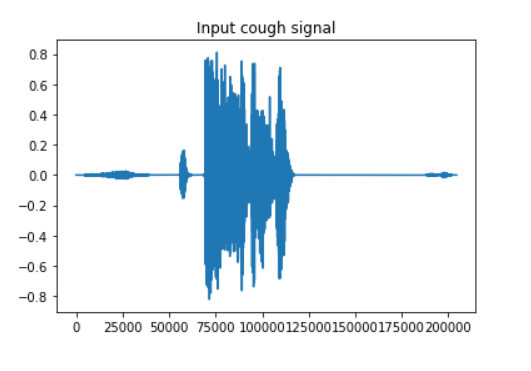
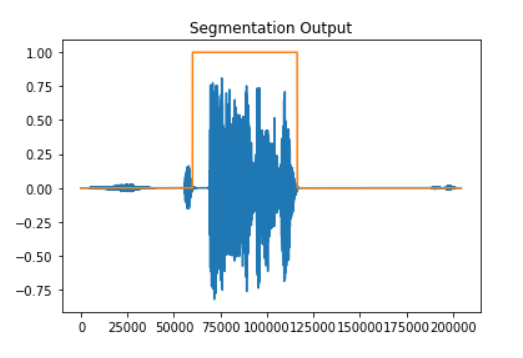
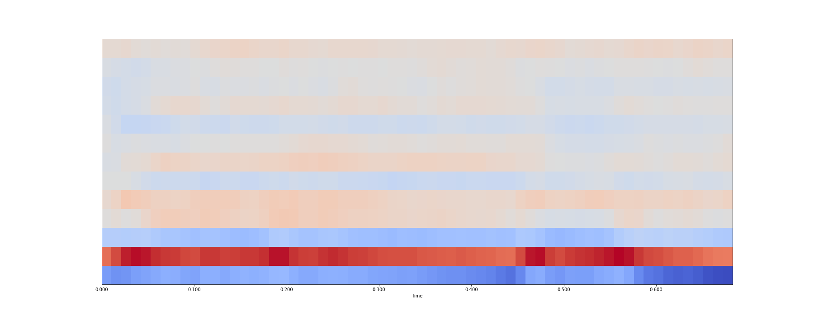
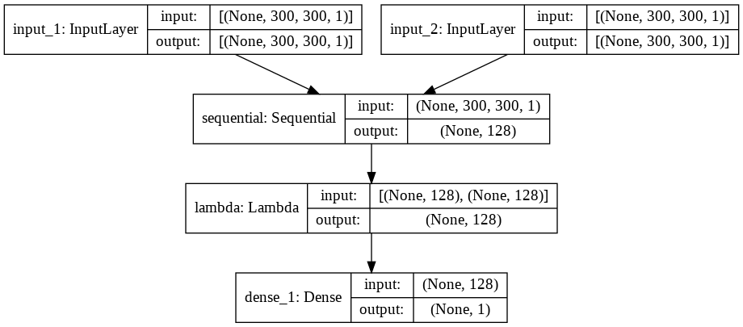
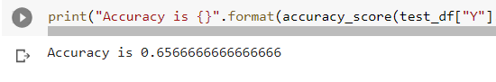
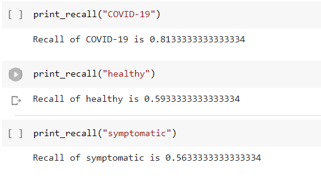

# COVID-19-Cough-Analysis
Using the coughvid dataset with recorded cough sounds to predict if patient is healthy, symptomatic or COVID-19 positive using deep learning

Dataset link : https://zenodo.org/record/4498364#.YOwXX-gzZEZ

Files : 

* ***segmentation.py*** - return cough segment and mask to apply on input
* ***prepare_dataset.ipynb*** - Extract cough segments and create mfcc plot dataset
* ***cough_classification_siamese.ipynb*** - siamese model training

## Step 1 : Loading Data and Extracting Features

* Load in the metadata_compiled.csv file from the dataset as a pandas dataframe.
  * healthy : 10784 samples
  * symptomatic : 2246 samples
  * COVID-19 : 862 samples

***While exploring the audio files most of the files with cough_detected < 0.2 had a lot of background noise or had no cough***

* Set sample rate to 48000 as mentioned in the data collection paper and load the audio files using the librosa library
* To explore the dataset i loaded in sample audio files from each class healthy, symptomatic and COVID-19
* I then segmented the cough segments from the cough audio and created an image database of mfcc spectrograms for the first segment from each audio

###### Input Cough Signal

###### Segmentation Output

###### MFCC of Sample Segment

## Step 2 : MODEL TRAINING

* Siamese Neural Networks have two of the same neural network which learns the features of the image. We have an additional layer that takes the output of both the neural networks and tries to minimize or maximize the distance between them
* So essentially the siamese neural network tries to learn a similarity function for each class.

###### MODEL ARCHITECTURE

## Step 3 : RESULTS

* Accuracy = 65.66% on test set
* Recall of COVID-19 = 81.33%
* Recall of healthy = 59.33%
* Recall of symptomatic = 56.33%

###### Metric Screenshots

## REFERENCES

* Orlandic, L., Teijeiro, T. & Atienza, D. The COUGHVID crowdsourcing dataset, a corpus for the study of large-scale cough analysis algorithms. *Sci Data* 8, 156 (2021). https://doi.org/10.1038/s41597-021-00937-4
